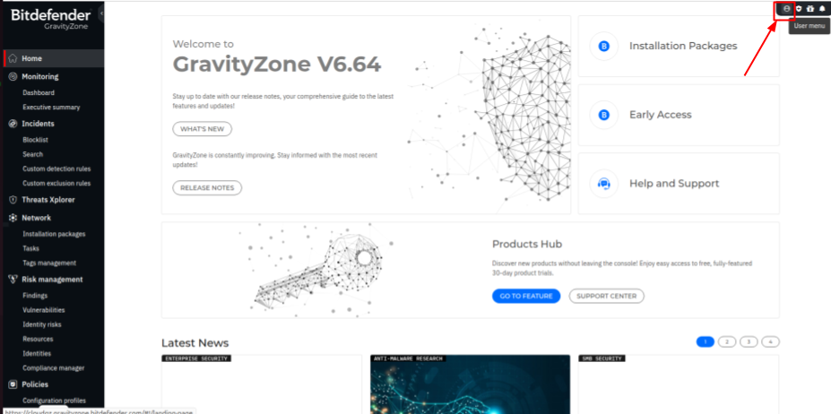
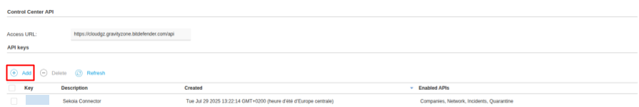
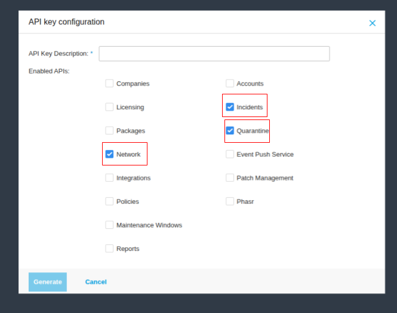

## Configuration

1. Log in to the Bitdefender GravityZone Control Center as an administrator.
2. In the top right, navigate to `User menu` > `My account`.

    

3. Go down and click the `Add` button to create a new API key.

    

4. Enter a description for the API key to identify its purpose.
5. Select the following permissions and scopes for the API key.

    

7. Click `Save` to generate the API key.
8. Copy the generated API key and store it securely. You will not be able to view it again.

> `Note:` Keep your API key confidential and restrict its usage to trusted applications only.