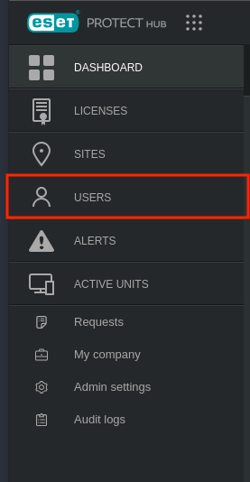
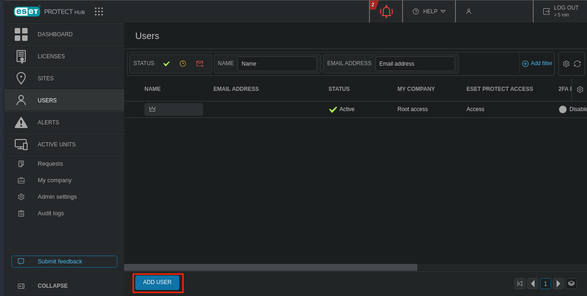
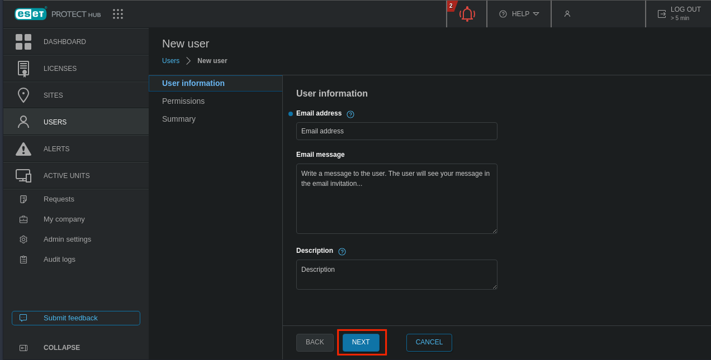
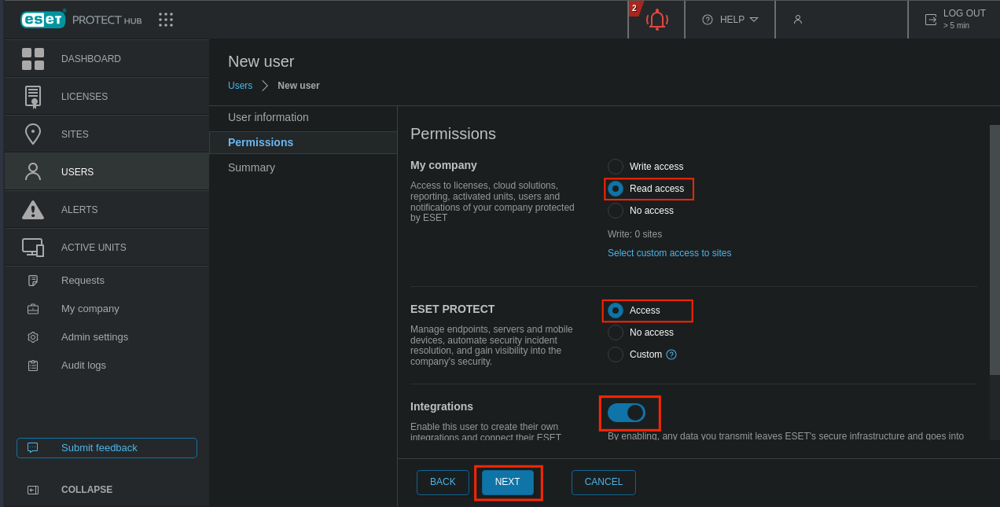

## Configuration

1. Log in to the ESET Protect Hub console as administrator
2. On the left panel, go to `USERS`

    {: style="max-width:100%"}

3. Click `ADD USER`

    {: style="max-width:100%"}

4. Type the email of the user and click `NEXT`

    {: style="max-width:100%"}

5. Select `Read access` for the `My company` permission
6. Select `Access` for the `ESET PROTECT` permission 
7. Check `Integrations`
8. Click `NEXT`

    {: style="max-width:100%"}

9. Click `CREATE`

## Asset connectors

The module provides two asset connectors that collect inventory from ESET Connect into Sekoia.io asset management. All of them authenticate with the module configuration (`region`, `username`, `password`) — no extra credentials are required. Each connector needs a Sekoia.io API key (`sekoia_api_key`) with asset-management write permission.

### ESET Device

Collects managed devices from the Device Management API (`{region}.device-management.eset.systems/v1/devices`) and maps them to OCSF Device Inventory Info assets.

### ESET Vulnerability

Collects device vulnerabilities from the Vulnerability Management API (`{region}.vulnerability-management.eset.systems/v1/device-vulnerabilities`) and maps them to OCSF Vulnerability Finding assets. Application, operating system and package vulnerabilities are all supported, with the affected host, CVE and severity attached to each finding. Requires ESET Vulnerability & Patch Management to be enabled on the account.
