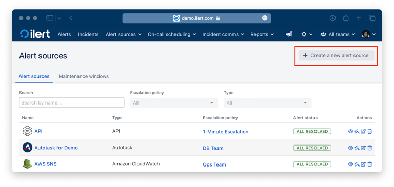
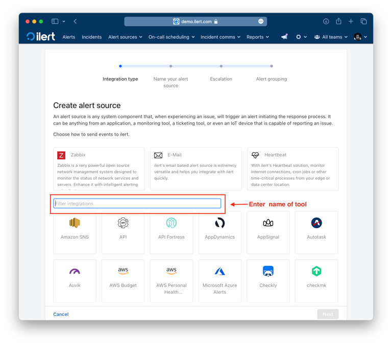
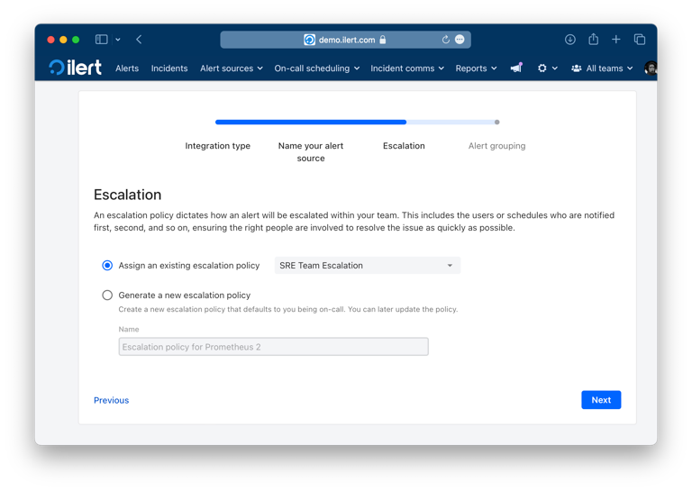
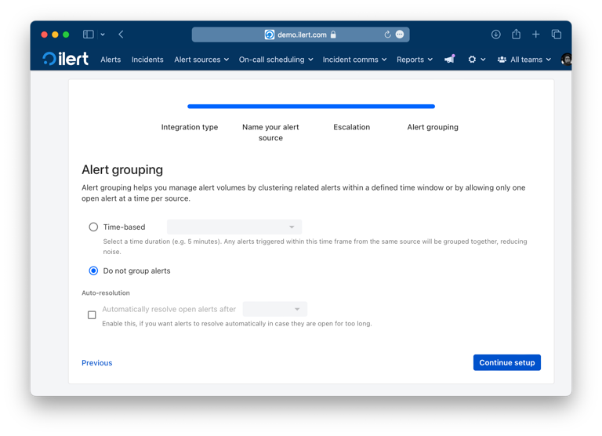
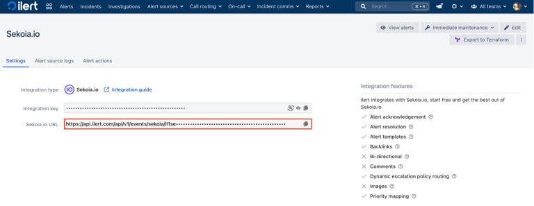
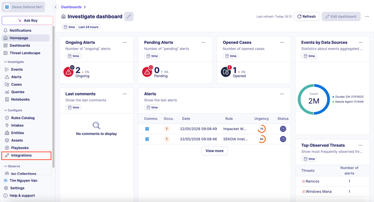
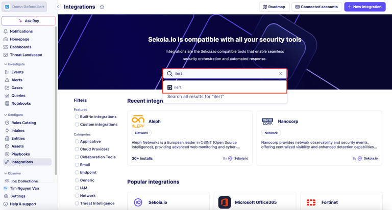
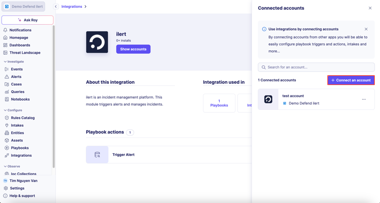
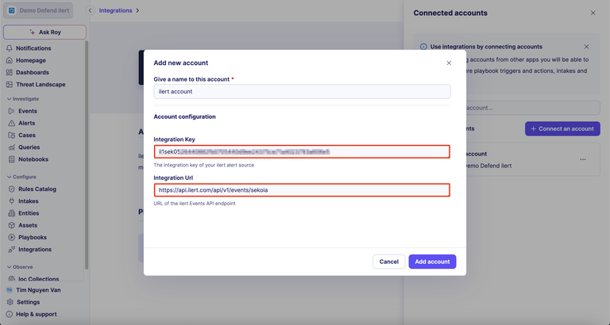
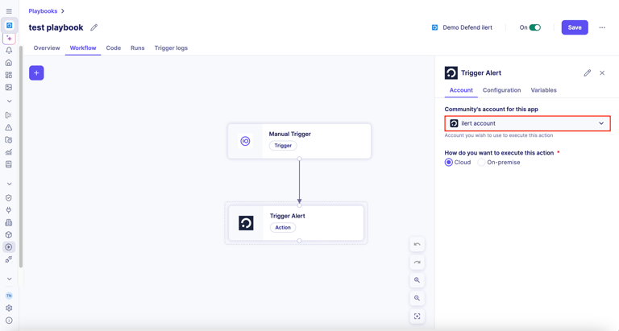

## Configuration

Forward Sekoia.io alerts to ilert via the `Trigger Alert` action so your on-call teams are notified and security incidents are tracked through to resolution.

### In ilert: Create a Sekoia.io alert source

1. Go to `Alert sources` > `Alert sources` and click `Create new alert source`.

    

2. Search for `Sekoia.io` in the search field, click the `Sekoia.io` tile, and then click `Next`.

    

3. Give your alert source a name, optionally assign teams, and click `Next`. Then select an escalation policy by creating a new one or assigning an existing one.

    

4. Select your alert grouping preference and click `Continue setup`. You may click `Do not group alerts` for now and change it later.

    

5. The next page shows additional settings, such as custom alert templates or notification priority. Click `Finish setup` for now. On the final page, copy the generated `integration key` and `Sekoia.io URL`. You will use both in the next steps.

    

### In Sekoia.io: Connect the ilert integration

6. In Sekoia.io, open `Integrations` from the sidebar.

    

7. Search for `ilert` and select the ilert integration from the results.

    

8. Click `Show accounts`, then `Connect an account`.

    

9. Fill in the `Add new account` form:

    - `Give a name to this account`: a label of your choice (e.g. `ilert account`).
    - `Integration Key`: the integration key from your ilert alert source.
    - `Integration Url`: `https://api.ilert.com/api/v1/events/sekoia`.

    Click `Add account`.

    

### In Sekoia.io: Use the Trigger Alert action in a playbook

10. Open or create a playbook in Sekoia.io, then add the `Trigger Alert` action from the ilert integration. In the `Account` tab, select the ilert account you just connected, configure the action input, and save the playbook.

    

Whenever the playbook runs the `Trigger Alert` action, a new alert is created on the corresponding Sekoia.io alert source in ilert.

> `Note:` If a Sekoia.io event is sent with the `status` key set to `resolved` or `closed`, the corresponding ilert alert is resolved automatically. If the `status` key is set to `acknowledged`, the alert is acknowledged automatically.